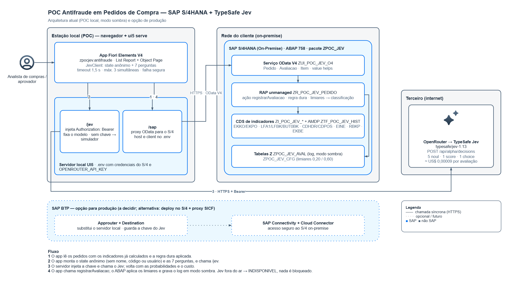

# POC antifraude em pedidos de compra — SAP S/4HANA + TypeSafe Jev

Prova de conceito que avalia o risco de fraude em pedidos de compra do SAP S/4HANA com o
**Jev**, modelo de decisão tipada da TypeSafe AI, acessado pelo OpenRouter.

O ABAP calcula indicadores de risco a partir dos dados do pedido, do fornecedor e do comprador.
Um app Fiori Elements envia esses indicadores, anônimos, ao Jev com sete perguntas tipadas. O
ABAP recebe as probabilidades de volta, aplica limiares e classifica o pedido em liberar,
aprovação ou bloqueio. Tudo roda em **modo sombra**: a avaliação é registrada, mas nenhum pedido
é bloqueado.



## O que a POC avalia

| Fraude | Pergunta ao Jev | Sinais usados |
|---|---|---|
| Fornecedor fictício | `fornecedor_ficticio` (noul) | idade do cadastro, cadastrado pelo próprio comprador, conta bancária compartilhada, histórico |
| Desvio de pagamento | `desvio_pagamento` (noul) | alterações de banco/endereço em 30 dias, condição de pagamento fora do padrão |
| Sobrepreço | `sobrepreco` (noul) | preço vs registro info e vs histórico do material |
| Fracionamento | `fracionamento` (noul) | pedidos ao mesmo fornecedor em 24h e 7 dias |
| Fraude interna | `fraude_interna` (noul) | comprador lança o recebimento, fatura anterior ao pedido, concentração |
| — | `atipicidade` (score 1–5) | visão geral frente ao histórico |
| — | `acao` (choice) | sugestão do modelo, só para comparação |

Fornecedor bloqueado é **regra dura** no ABAP e não vai ao Jev. A classificação é sempre do
ABAP: risco máximo abaixo de 0,20 libera, até 0,60 vai para aprovação, acima bloqueia. Os
limiares são hipótese a calibrar.

## Estrutura

```
abap/        fonte dos 28 objetos (pacote ZPOC_JEV + subpacote ZPOC_JEV_WRAP), exportados do sistema
  tables/    ZPOC_JEV_AVAL (log) e ZPOC_JEV_CFG (limiares)
  cds/       views de indicadores (só APIs liberadas), raiz RAP e projeções
  behavior/  BDEF unmanaged e de projeção (ação registrarAvaliacao)
  metadata/  anotações de UI (DDLX)
  service/   service definition e descrição do binding OData V4
  classes/   behavior pool, desvio padrão/z-score (ZCL_POC_JEV_STATS) e classe de setup
  wrap/      wrapper liberado sobre os documentos de modificação (único acesso não liberado)
app/         app Fiori Elements V4 (List Report + Object Page) com o cliente do Jev
docs/        documentação completa (HTML/PDF) e diagrama de arquitetura (.drawio/.png)
gap-analysis.md      análise de lacunas e desenho aprovado do backend
backend-contract.md  contrato do serviço OData usado pelo front
jev-api.md           referência da API do Jev via OpenRouter
system-info.md       capacidades do sistema usado na POC
```

## Requisitos

- SAP S/4HANA on-premise com RAP e OData V4 (testado em ABAP 758, banco HANA)
- Node.js 18+ para o app
- Chave do OpenRouter para o Jev real; sem chave, o app usa um simulador local

## Como instalar

**Backend.** Crie o pacote `ZPOC_JEV` com o subpacote `ZPOC_JEV_WRAP` e os objetos de `abap/` na
ordem das camadas: tabelas → wrapper (marcar como API liberada C1) → CDS de indicadores e
`ZCL_POC_JEV_STATS` → raiz e filha → BDEF e behavior pool → projeções → DDLX → service definition →
service binding (OData V4 UI, publicar). Depois rode `ZCL_POC_JEV_SETUP` (F9 no ADT) para gravar os
limiares.

**Clean core.** O ATC com a variante `ABAP_CLOUD_READINESS` dá 0 achados no núcleo. Os únicos 2
achados ficam no wrapper `ZI_POC_JEV_W_CHGDOC`, que lê os documentos de modificação, para os quais
a SAP não oferece API liberada. Detalhes em [clean-core-analysis.md](clean-core-analysis.md).

**Frontend.**

```bash
cd app
npm install
cp .env.example .env    # host, client, usuário e senha do S/4 + OPENROUTER_API_KEY
npm start               # http://localhost:8080/index.html
npm test                # testes unitários
```

Detalhes, falha segura e simulador em [app/README.md](app/README.md).

## Segurança e LGPD

- A chave do Jev fica só no servidor local (`.env`, fora do git) e nunca chega ao navegador.
- Nenhum nome, código de fornecedor, usuário ou número de pedido é enviado ao Jev, só dias,
  razões, contagens e flags. Um teste automático garante isso.
- As views Z estão sem checagem de autorização (DCL). Aceitável para a POC, não para produção.

## Custo

Medido na primeira chamada real: **US$ 0,0000913 por avaliação** (7 perguntas), cerca de
US$ 0,09 a cada mil pedidos. O Jev cobra só os tokens de entrada.

## Status e próximos passos

POC funcional em ambiente de teste. Antes de produção: ação do aprovador para rotular os casos,
calibração dos limiares com histórico real, hospedagem da rota do Jev (BTP ou S/4), autorização
nas views e alinhamento da versão SAPUI5. A lista completa está na seção 18 da
[documentação](docs/POC_Jev_Antifraude.html).
